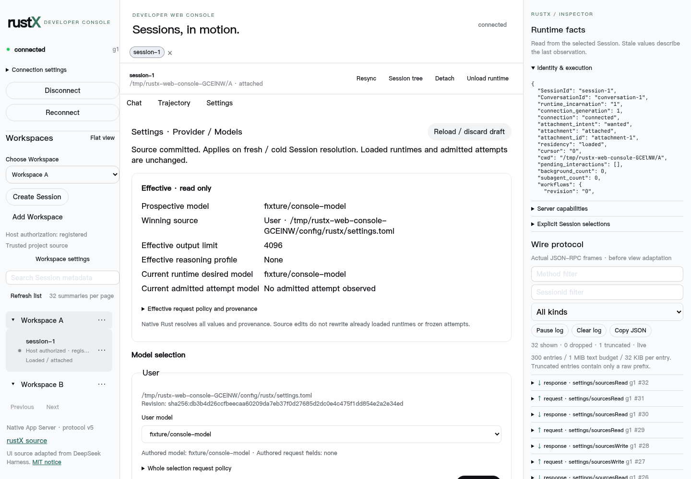
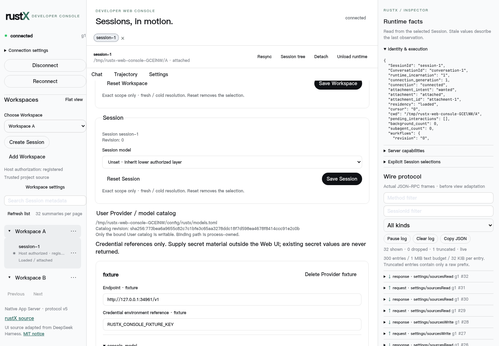

# WEB-08 implementation and review guide

Starting `origin/main`: `e15b55e0e067352d1720d66e2be3243921d6ea21`.
Branch: `feat/web-08-settings`.

## Ownership and concurrency

The existing native `UserConfigManager` owns structured authoring on already-bound
sources. `ModelLayer` remains the source syntax owner; `resolve_session` remains the
only source/default precedence resolver. `ModelCatalog::view` is now shared by
source settings and `ModelBindingRegistry`; the browser has no model registry.

The native projection carries exact User, Workspace and catalog content revisions,
partial authored model fields, normalized selections, native provenance, prospective
model/request values and trust. Session settings revision/selection are read while
the native Session catalog mutex is retained across source projection. Runtime
incarnation/current desired model and frozen attempt facts come from the existing
runtime snapshot and are displayed separately.

Source CAS holds the persistent sibling document locks shared with the existing
User-default writer across revision verification, canonical validation (including context budgets), temporary
file sync and atomic rename. The rename is the publication linearization point.
Competing cooperating writers cannot commit between the check and rename. A stale
request leaves source bytes unchanged. Exact content fingerprints also reject
edits after observable external file changes; a final reread refuses mixed source
snapshots. Arbitrary external editors that ignore native locks can still race the
last fingerprint check and rename. No distributed coordination or stronger
filesystem transaction guarantee is claimed.

Session selection CAS retains the existing Session catalog mutex through revision
validation and catalog publication. The durable settings revision is independent
of source file revisions. Reset persists omission. It never copies effective state
into the reset scope. Session authoring is prospective, like existing Session
settings replacement; live `/model` changes continue through the existing native
model/persistence owner. Source writes never automatically reload or cancel work.

## Protocol

- `settings/sourcesRead { session_id }` returns `source_settings`: native projection,
  Session revision and explicit selection.
- `settings/sourcesWrite { session_id, expected_revision, mutation }` accepts typed
  `catalog`, `user_model`, or `workspace_model` authoring and returns the new
  projection. `selection: null` removes the selected scope. Catalog authoring has
  no Workspace/Session variant and cannot change source bindings.
- `settings/selectModel { session_id, expected_revision, selection }` validates a
  whole Session model selection or omission and commits through existing Session
  CAS, returning `settings_replaced`.
- `source_conflict { scope, expected, actual }` is a structured source conflict.
  Session conflicts remain `stale_settings`; trust failures are
  `untrusted_workspace`. Native validation/I/O failures use existing structured
  errors. A publication followed by an unreadable projection reports committed
  uncertainty, never an instruction to blindly retry.

The existing runtime model/catalog and durable Session settings APIs describe
separate native facts, not competing configuration engines. Generated v5 schema,
TypeScript, TUI loss classification/error handling and Web read classification
are updated together.

## UI and source reuse

The Settings tab uses the WEB-07 shell and shared primitives. The Workspace settings
entry opens the editor instead of its old status placeholder. The chat composer is
hidden while editing Settings. Effective/provenance facts, source targets, revisions,
trust and apply lifetime are visible. Model selectors use native catalog entries.
Provider cards author endpoint, credential reference, model identities/protocols,
limits, explicit capabilities, reasoning profiles, request defaults and compatibility.
There are no native display-name fields, secret-write API or bounded discovery/probe
API, so these are not fabricated by Web Console.

A failed CAS retains drafts, refreshes authoritative state and permits only explicit
retry/discard. Lost responses are repaired by reads without replay. Inputs are kept
in component state, never browser persistence. Credential values are never returned;
existing literal credentials use a retention marker understood only by native code.

Pinned Harness source: `deepseek-ai/deepseek-harness@c291e7961a515f6d7af9304e7fd1d257929aef26`.
Inspected Settings/general/models/selection source, tests, CSS and docs are recorded
in `web-console/source-inventory.json`; presentation reuse and excluded semantic
owners are recorded in `web-console/PROVENANCE.md`.




## Deterministic regressions

- `native_precedence_provenance_reset_and_separate_cas_domains`: Session > trusted
  Workspace > User, native provenance, clearing fallthrough, separate source revisions.
- `untrusted_workspace_and_unknown_model_fail_without_mutation`: no implicit trust
  or unknown model mutation.
- `competing_catalog_writers_have_one_publication_and_one_conflict`: barrier-started
  writers share one revision; exactly one publishes and the loser changes nothing.
- Catalog round-trip tests: structured add/edit/delete, invalid endpoint rejection,
  stale/external revision rejection and native literal-secret retention without readback.
- `web08_source_and_session_cas_cross_the_real_protocol_boundary`: read/write/reread,
  source and Session typed conflicts, provenance serialization and no stale mutation.
- `web08_catalog_commit_preserves_admitted_attempt_and_updates_cold_resolution`:
  a gated Provider attempt and loaded desired model stay unchanged while a cold
  Session sees committed catalog limits.
- Six Web tests cover backend effective/provenance rendering, native options,
  exact revision submission, success refresh, preserved conflict drafts, Session
  reset, uncertain response no-replay, loading/error/empty states.
- Real-server browser Settings save/reset/catalog editing, desktop/mobile geometry
  and zero Provider requests; the complete existing browser suite also runs.

## Validation commands

From the repository root unless a directory is shown:

```sh
cargo fmt --all -- --check
cargo clippy --workspace --all-targets --all-features -- -D warnings
cargo build --bins
RUSTX_REQUIRE_PROVIDER_EMULATOR=1 cargo test --workspace --all-targets --all-features
RUSTX_REQUIRE_PROVIDER_EMULATOR=1 cargo test --workspace --all-features
cargo test --lib configuration::settings::tests --all-features
cargo test --lib web08 --all-features
cargo check --all-targets --all-features
cargo run --example generate_app_server_protocol
git diff --check

# test-support/fake-provider
uv sync --frozen
uv run --frozen pytest

# web-console, tui, protocol/app-server
pnpm install --frozen-lockfile

# web-console
pnpm typecheck
pnpm test
pnpm exec vitest run test/settings.test.tsx
pnpm check:provenance
pnpm build
pnpm exec playwright test settings.spec.ts
pnpm test:e2e

# tui
pnpm typecheck
RUSTX_REQUIRE_PROVIDER_EMULATOR=1 pnpm test

# protocol/app-server
node generate.mjs
pnpm typecheck
pnpm check
```

The Web package has no separate lint or formatting script. Production build reports
its existing bundle-size advisory. During development, compiler/typecheck/lint
failures were fixed; the first Settings browser attempt used an incorrect locator
and was interrupted, and the next exposed a fixture teardown expectation for chat
turns. The corrected Settings test asserts zero Provider requests. Final results
are recorded in the PR; unrun checks are never represented as passes.
